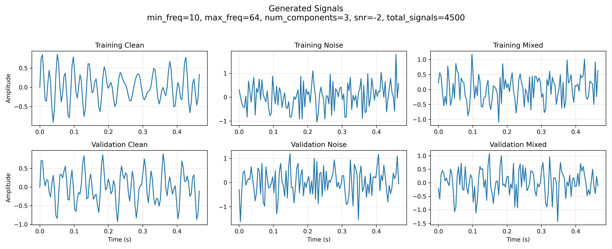
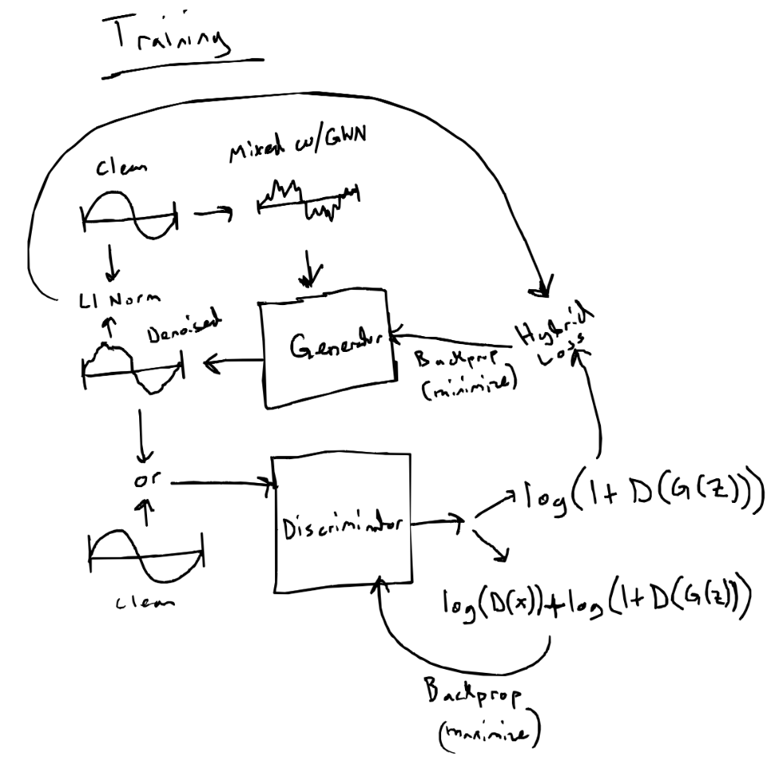
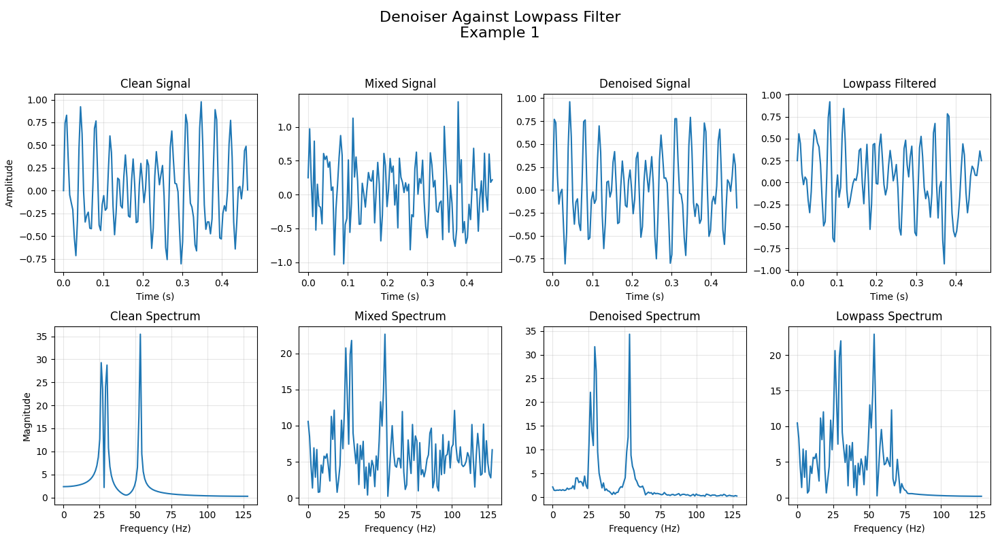
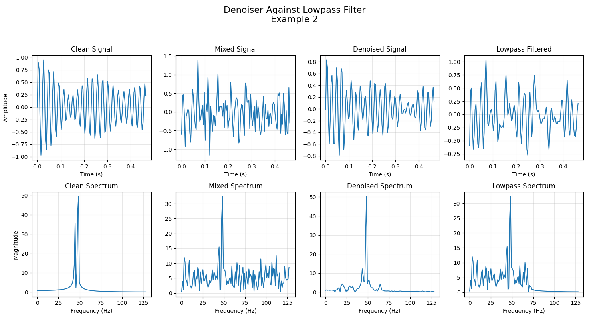

# Denoising Adversarial Network (DAN)

Denoising Autoencoder trained on a generative adversarial network (GAN). Autoencoder for use in denoising
audio signals.

## Current State

Capable of being trained on denoising sinusoidal composition signals corrupted with Gaussian White Noise (GWN)

These are notable constraints, and even with these, the training process is computationally expensive when training on a standard laptop.

Can assumably be extended to train on higher sample rates, far lower signal-to-noise (SNR) ratios, and more complex sinusoid compositions when given proper computational power.

## Setup

Install dependencies in requirements.txt

Setup a data folder as follows:
```
GAN-Denoiser
├── data
│   ├── resampled
│   ├── train
│   │   ├── clean
│   │   ├── mixed
│   │   └── noise
│   └── validation
│       ├── clean
│       ├── mixed
│       └── noise
└── ...
```
This is where created noise, sine, and mixed (noise + sine) signals will be stored.

Run create_data.py
This should result in folders being filled with data, and displaying plots for a random signal from each folder.
Signals should be displayed as follows (different of course, since they are randomly generated)


Then run dataset.py to verify that everything is working properly (this won't actually do anything to memory)

Now we can run train_gan.py

Fine-tune hyperparameters (generator architecture, discriminator architecture, data creation parameters, training parameters) as desired.

## Architecture

Consists of 2 models:
- Generator (aka Denoising Autoencoder)
- Discriminator

### Generator

The Generator is an autoencoder based strongly off of [this article](https://www.mathworks.com/help/signal/ug/denoise-signals-with-generative-adversarial-networks.html) by Mathworks. It is tasked with taking as input a noisy signal and outputting a denoised version of that signal.


### Discriminator

The Discriminator is tasked with distinguishing clean signals apart from faux clean signals (denoised signals produced by the generator). 


### Training

The Discriminator is trained in classic GAN fashion, using the BCE loss between clean signals and denoised signals.

The Generator, however, is trained on a hybrid loss function. It uses adversarial loss, just as so in a standard GAN, but also reconstruction loss. The adversarial loss is just BCE loss upon how well it "fools" the discriminator. The reconstruction loss is the L1 Norm between the clean signal and the generated denoised signal. 



### Example

Training on the same dataset from the created data example above, we see the following performance and generator results:




As we see, the lowpass filter clearly excels at removing high-frequency-noise -- it's in it's name. However, he generator denoiser is capable of removing both high-frequency-noise and low-frequency-noise, that which falls in the range of the sine waves. When training a generator with more filters, a deeper autoencoder, and a stronger discriminator, we expect these effects to only heighten.

Spectral filtering can achieve similar metrics, but runs into problems as the signal-to-noise ratio falls. 

## Citations

As aforementioned, a lot of the confidence in building this model, and the layout of the models and training process itself, is all strongly inspired by [this article](https://www.mathworks.com/help/signal/ug/denoise-signals-with-generative-adversarial-networks.html) by Mathworks. In essence, we try to attempt 

There's been notable advancements in denoising methods using similar architectural methods, such as deep feature loss as utilized by [Zhang et al. 2024](https://www.sciencedirect.com/science/article/pii/S1574954124000591). This repo was inherently inspired by this paper, as an attempt to build a foundational understanding of such CNN denoisers.

